# Курсовая работа по дисциплине: Проектирование высоконагруженных систем (Highload_Ula).
## Тема: Юла

### 1. Целевая аудитория

#### Распределение аудитории
| Страна      | Процент аудитории |  Количество пользователей в месяц   | Количество пользователей в день |
| :---        |    :----:   |        :----:   | ---:|
| Россия      | 85,9%       | 23 193 000   | 773 100 |
| Германия   | 4,3%       | 1 161 000      | 38 700 |
| Великобритания   | 	2,3%        | 621 000      | 20 700 |

- Количество активных пользователей в месяц: 27 млн человек.
- Средний возраст пользователей: от 18 до 35 лет.


#### Поведение пользователей (в рамках дня)
| Время на сайте      | Количество страниц за посещение | Количество размещений |  Отказы   |
| :---        |    :----:   |        :----:   | ---:|
| 7 минут | 6       | 0.25 | 42% |

### 2. Расчет нагрузки

1) Оценка количества новых пользователей в день.
   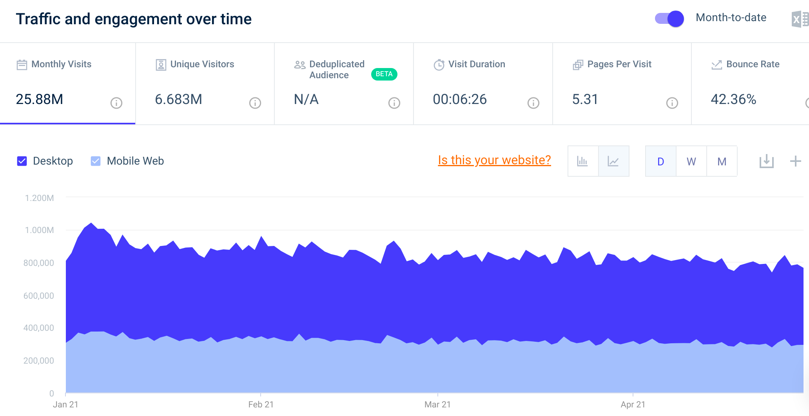
   - Рассмотрим количество пользователей в последние 6 месяцев
     
        | Октябрь<span style="color:white">__</span>| Ноябрь<span style="color:white">___</span> | Декабрь<span style="color:white">__</span> |  Января<span style="color:white">___</span>   | Февраль<span style="color:white">__</span>   | Март<span style="color:white">_____</span>  |
        | :---        |    :----:   | :----:   |:----:   | :----:   | ---:|
        | 29 333 517 | 27 481 394  | 28 038 666 | 27 083 573 | 23 196 570 | 24 892 581|
    
        Средний прирост в месяц:  ((28 038 666 - 27 481 394) + (24 892 581 - 23 196 570)) : 2 ~= 1 126 642<br>
        Средний прирост в день: 1 126 642 : 30 ~= 37 555<br>
        Регистируется каждый 10 пользователь, следовательно количество регистрацией в день: 3 756<br>
        Количество пользователей в день: 832 500, следовательно количество регистрацией в день на одного пользователя:<br>
        3 756 : 832 500 = 0.005
     

2) Рассмотрим усредненную пользовательскую модель действий в день:
    - авторизация - 1 раз
    - регистрация - 0.005 раз
    - Количество страниц за посещение - 6:
        - посещение главной страницы - 1 раз
        - посещение станицы категории - 2 раза
        - посещение станицы поиского запроса - 2 раза
        - посещение станицы мои объявления - 0.1 раза
        - посещение станицы мои заказы - 0.5 раза
        - посещение станицы кошелек - 0.1 раза
        - посещение станицы мои сообщения - 0.3 раза
    - отправка сообщений - 1
    - размещений - 0.25 раз
   
3) Расчет среднего размера хранилища пользователя:
   - профиль: 449 байт, учитывая максимальную заполняемость профиля, средняя заполняемость профиля 40% (180 байт)
   - количество объявления на пользователя: 0.15, максимальное количество объявления пользователя - 50<br>
     маскимальный размер одного объявления - 1006 байт, средний 400 байт, т.е. под объявления необходимо 50 * 1006 = 50300 байт максимально,<br>
     0.15 * 400 байт = 60 байт
   - закладки: размер одной закладки - 24 байт, максимальное количество закладок пользователя - 100, среднее 20<br>
     т.е. под закладки максимально необходимо 100 * 24 = 2400 байт, среднее 20 * 24 = 480 байт.
   - отзывы: маскимальный размер одного отзыва - 152 байт, максимальное количество отзывов пользователя - 1000, среднее 200 <br>
     т.е. под отзывы необходимо 1000 * 152 = 152000 байт, среднее 200 * 152 = 30400 байт.
   - <b>итого:
      - максимальный размер хранилища пользователя: 449 байт + 50300 байт + 2400 байт + 152000 байт = 205 149 байт = 200.34 КБ
      - средний размер хранилища пользователя: 180 байт + 60 байт + 480 байт + 30400 байт = 31120 байт = 30.39 КБ
     </b>
     
    

4) Оценка трафика
    - Авторизация 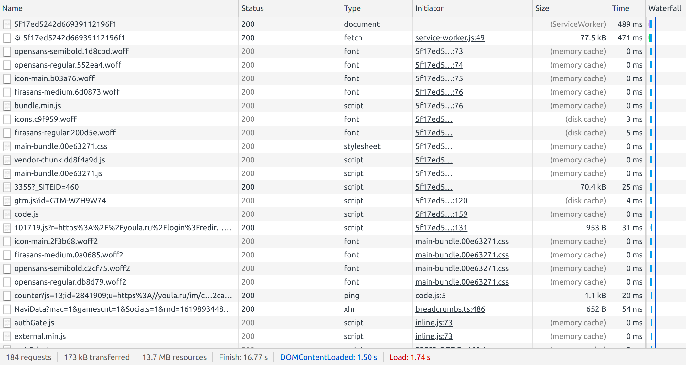 Объем трафика ~ 173 КБ, количество запросов: 184<br><br>
    - Регистрация 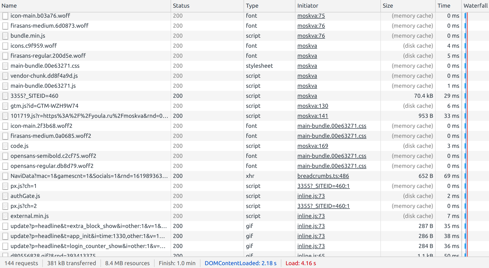 Объем трафика ~ 381 КБ, количество запросов: 144<br><br>
    - Главная страница 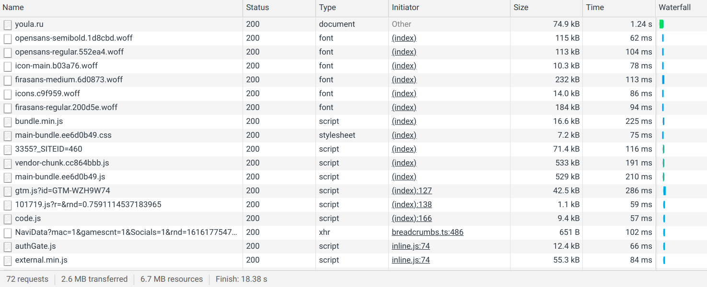 Объем трафика для посещения страницы ~ 2.6 МБ, количество запросов: 72<br><br>
    - Страница категории 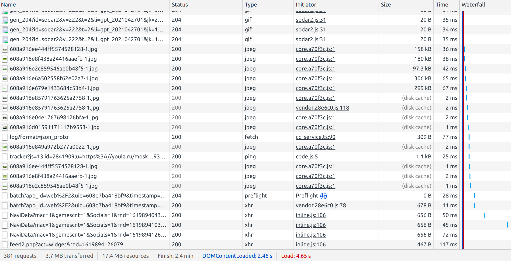 Объем трафика для посещения страницы ~ 3.7 МБ, количество запросов: 381<br><br>
    - Страница поиского запроса  Объем трафика для посещения страницы ~ 3.4 МБ, количество запросов: 325<br><br>
    - Страница мои объявления 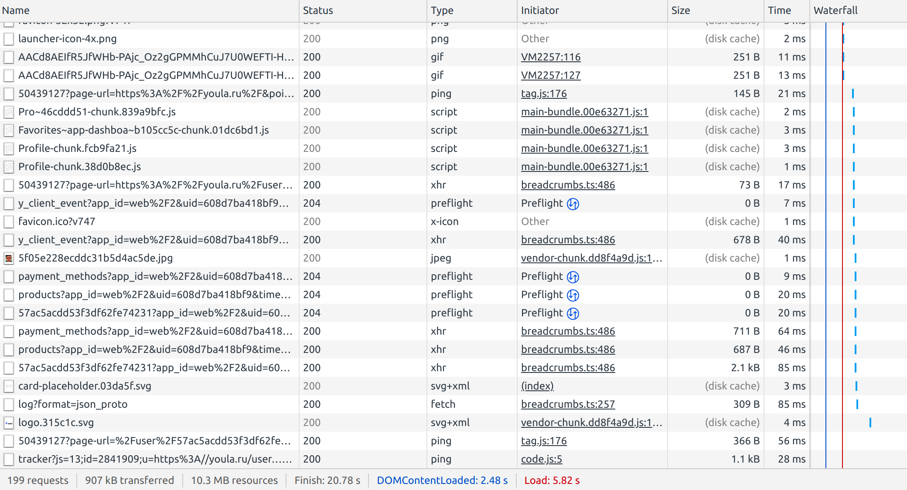 Объем трафика для посещения страницы ~ 907 КБ, количество запросов: 199<br><br>
    - Страница мои заказы 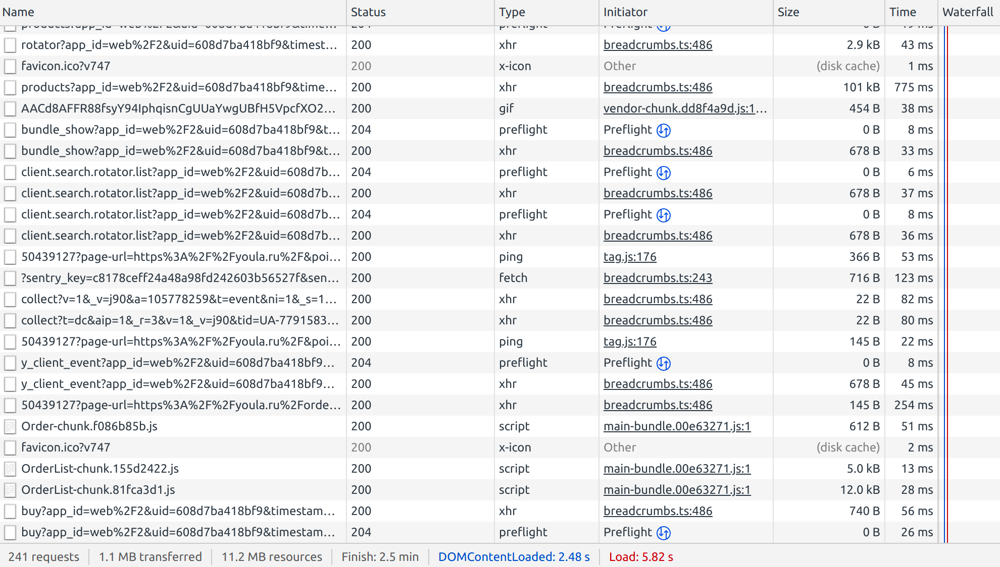 Объем трафика для посещения страницы ~ 1.1 МБ, количество запросов: 241<br><br>
    - Страница кошелек 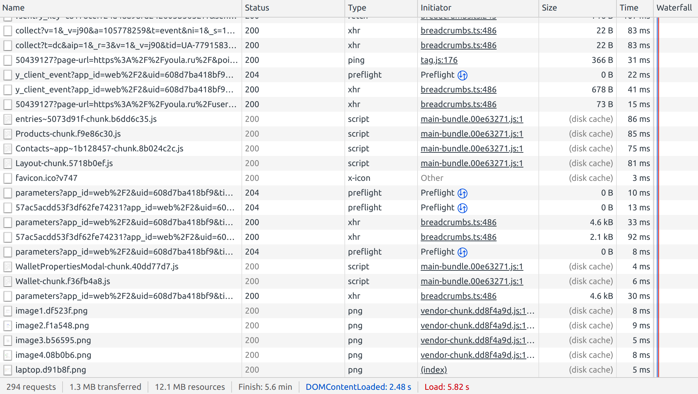 Объем трафика для посещения страницы ~ 1.3 МБ, количество запросов: 294<br><br>
    - Страница мои сообщения 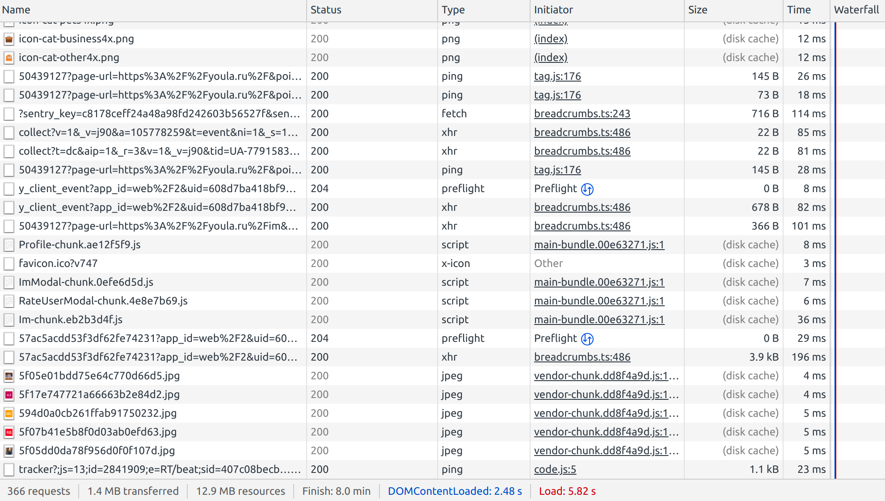 Объем трафика для посещения страницы ~ 1.4 МБ, количество запросов: 366<br><br>
    - Отправка сообщения 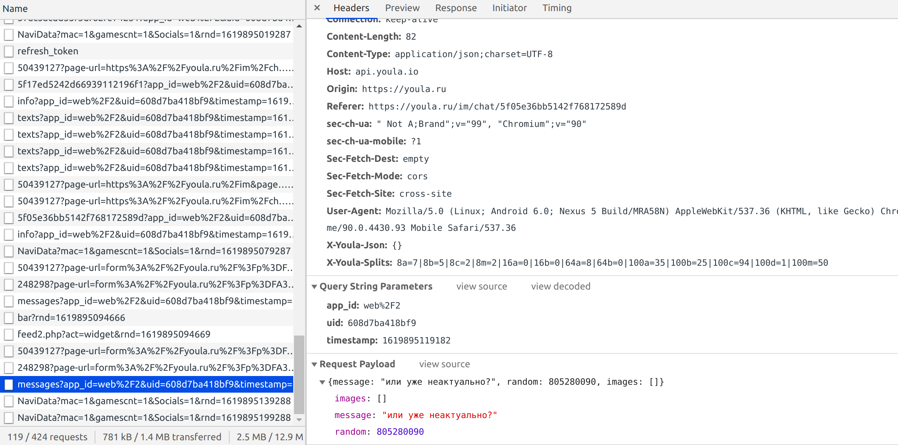  Объем трафика ~ 1 МБ, количество запросов: 1<br><br>
    - Отправка объявления 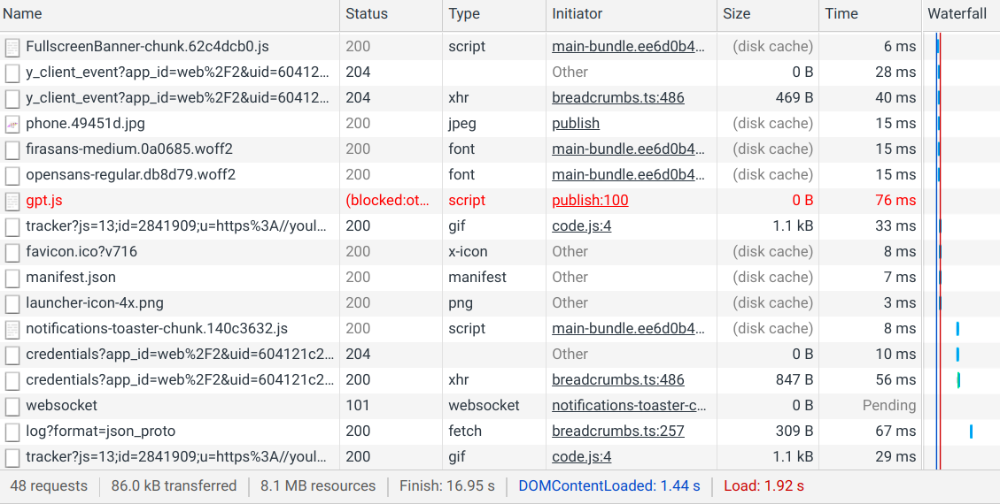 Объем трафика ~ 5 МБ, количество запросов: 1211<br><br>

5) Расчет трафика для одного пользовател в день
    - 173 КБ * 1 = 173 КБ, 184 * 1 = 184 запроса
    - 381 КБ * 0.005 = 1.91 КБ, 144 * 0.005 = 0.72 запроса
    - 2.6 МБ * 1 = 2.6 МБ, 72 * 1 = 72 запроса
    - 3.7 МБ * 2 = 7.4 МБ, 381 * 2 = 762 запроса
    - 3.4 МБ * 2 = 6.8 МБ, 325 * 2 = 650 запроса
    - 907 КБ * 0.1 = 91 КБ, 199 * 0.1 = 19.9 запроса
    - 1.1 МБ * 0.5 = 550 КБ, 241 * 0.5 = 120.5 запроса
    - 1.3 МБ * 0.1 = 130 КБ, 294 * 0.1 = 29.4 запроса
    - 1.4 МБ * 0.3 = 420 КБ, 366 * 0.3 = 109.8 запроса
    - 1 МБ * 1 = 1 МБ, 1 * 1 = 1 запроса
    - 5 МБ * 0.25 = 1.25 МБ, 1211 * 0.25 = 302.75 запроса
    - <b>Итого: 20.4 МБ, 2252 запроса</b>


6) Расчет дискового пространства для одного пользовател в день:
    - Регистрация: до 0.005 * 449 байт = 2.25 байт
    - Отправка сообщений: до 1 * 240 байт = 240 байт
    - Отправка объявлений: до 0.25 * 1006 байт = 251.5 байт
    - <b>Итого: 493.75 байт = 0.48 КБ, для всех 390.23 МБ</b>


7) Расчет дневного трафика
    - получаемый трафик<br>
      (2.6 МБ + 7.4 МБ + 6.8 МБ + 91 КБ + 550 КБ + 130 КБ + 420 КБ) * 832 500 = 15 313 171 500 КБ = 14.3 ТБ<br>
      72 + 762 + 650 + 19.9 + 120.5 + 29.4 + 109.8 = 1763.6 запроса
       
    - передаваемый трафик<br>
      (173 КБ + 1.91 КБ + 1 МБ + 1.25 МБ) * 832 500 = 2 063 692 575 КБ = 1.9 ТБ<br>
      184 + 0.72 + 1 + 302.75 = 488.47 запроса


8) Оценка пользовательской активности в день<br>
   Учитывая тот факт, что пользователи сервиса проживают в России, Германии, Великобритании.<br>
   Интервал часовых поясов:<br>
   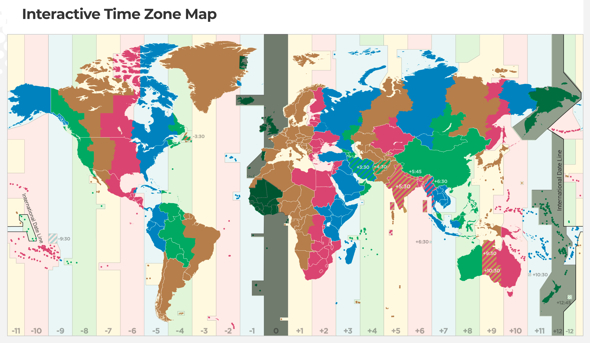
   Пользователи располагают от UTC+0:00 до UTC+12:00<br>
   Пользовательские часы начинаются с 09:00 по UTC+12:00, заканчиваются в 20:00 по UTC+0:00,<br>
   т. е. 32 - 9 часов = 23 часа


9) Оценка существенных запросов<br>
   - (184 * 832 500) запросов : (23 * 3 600) секунд = 1850 запросов в секунду
   - (0.72 * 832 500) запросов : (23 * 3 600) секунд = 7.24 запросов в секунду
   - (72 * 832 500) запросов : (23 * 3 600) секунд = 723.91 запросов в секунду
   - (762 * 832 500) запросов : (23 * 3 600) секунд = 7661.4 запросов в секунду
   - (650 * 832 500) запросов : (23 * 3 600) секунд = 6535.32 запросов в секунду
   - (19.9 * 832 500) запросов : (23 * 3 600) секунд = 200.08 запросов в секунду
   - (120.5 * 832 500) запросов : (23 * 3 600) секунд = 1211.54 запросов в секунду
   - (29.4 * 832 500) запросов : (23 * 3 600) секунд = 295.59 запросов в секунду
   - (109.8 * 832 500) запросов : (23 * 3 600) секунд = 1103.96 запросов в секунду
   - (1 * 832 500) запросов : (23 * 3 600) секунд = 10.05 запросов в секунду
   - (302.75 * 832 500) запросов : (23 * 3 600) секунд = 3043.95 запросов в секунду

10) Суммарный суточный трафик запросов<br>
   - 173 КБ * 832 500 = 137.35 Гбайт/сутки
   - 1.91 КБ * 832 500 = 1.52 Гбайт/сутки
   - 2.6 МБ * 832 500 = 2113.77 Гбайт/сутки
   - 7.4 МБ * 832 500 = 6016.11 Гбайт/сутки
   - 6.8 МБ * 832 500 5528.32 Гбайт/сутки
   - 91 КБ * 832 500 = 72.25 Гбайт/сутки
   - 550 КБ * 832 500 = 436.66 Гбайт/сутки
   - 130 КБ * 832 500 = 103.21 Гбайт/сутки
   - 420 КБ * 832 500 = 333.45 Гбайт/сутки
   - 1 МБ * 832 500 = 812.98 Гбайт/сутки
   - 1.25 МБ * 832 500 = 1016.24 Гбайт/сутки

11) Пиковая оценка запросов в теченнии суток<br>
   - GET: (1763.6 * 832 500) запросов : (23 * 3 600) секунд = 17 732 запросов в секунду
   - POST: (488.47 * 832 500) запросов : (23 * 3 600) секунд = 4 911 запросов в секунду

12) Оценка пикового потребления в теченнии суток<br>
   - получаемый трафик: (15 313 171 500 КБ : 125 000) Гбит : (23 * 3 600) секунд = 1.48 Гбит/с
   - передаваемый трафик: (2 063 692 575 КБ : 125 000) Гбит : (23 * 3 600) секунд = 0.2 Гбит/с
   
#### Итог по нагрузке:
- получаемый трафик: 1.48 Гбит/с, 17 732 GET-запросов в секунду
- передаваемый трафик: 0.2 Гбит/с, 4 911 POST-запросов в секунду

### 3. Логическая схема БД
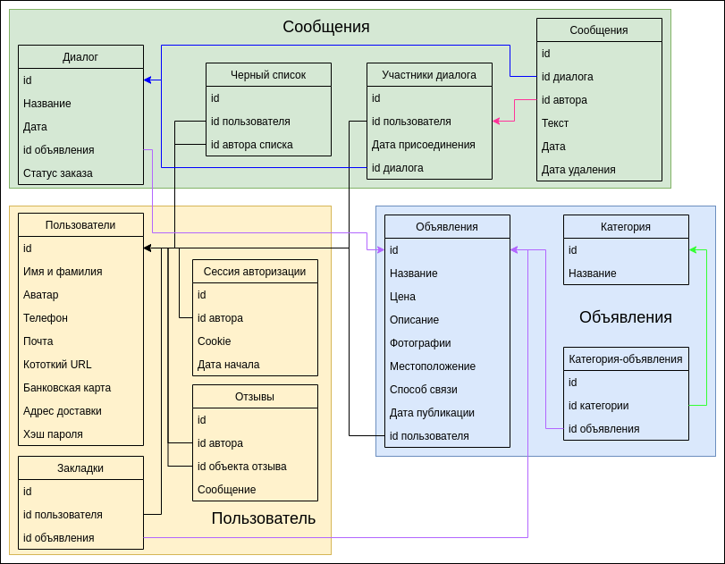

### 4. Физическая схема БД
   - Таблица пользователи
     
  | id | Имя и фамилия | Аватар |  Телефон | Почта | Короткий url | Банковская карта | Адрес доставки | Хэш пароля |
  | :---        |    :----:   | :----:   |:----:   | :----:   | :----:   | :----:   | :----:   | ---:|
  | bigint | varchar(40) | varchar(40), название файла в S3 | varchar(13) | varchar(30) | varchar(30) | varchar(60)| varchar(100)|  varchar(128)|

   Максимальный размер одного пользователя: 8 байт + 40 байт + 40 байт + 13 байт + 30 байт + 30 байт + 60 байт + 100 байт + 128 байт = 449 байт = 0.44 КБ

  - Таблица закладки

   | id | id пользователя | id объявления |
   | :---  |    :----:   | ---:|
   | bigint | bigint  | bigint  |

   Максимальный размер одной закладки: 8 байт + 8 байт + 8 байт = 24 байт = 0.023 КБ

   - Таблица отзывы

   | id | id автора | Cookie | Дата начала |
   | :---  |    :----:   | :----:   | ---:|
   | bigint | bigint  | varchar(128)  |  timestamp  |

   Максимальный размер одного отзыва: 8 байт + 8 байт + 128 байт + 8 байт = 152 байт = 0.15 КБ

   - Таблица сессия авторизации

   | id | id автора | id объекта отзыва | Сообщение |
   | :---  |    :----:   | :----:   | ---:|
   | bigint | bigint  | bigint  |  varchar(200) |

   Максимальный размер сессии авторизации: 8 байт + 8 байт + 8 байт + 200 байт = 224 байт = 0.22 КБ

   - Таблица объявления

   | id | Название | Цена |  Описание | Фотографии | Местоположение | Способ связи | Дата публикации |id пользователя |
   | :---  | :----:   | :----:   |:----:   | :----:   | :----:   | :----:   | :----:   |  ---:|
   | bigint | varchar(30) | varchar(30) | varchar(600)  | varchar(40)(название файла в S3) array[5] | varchar(100) | varchar(30)| timestamp | bigint|

   Максимальный размер одного объявления: 8 байт + 30 байт + 30 байт + 600 байт + 200 байт + 100 байт + 30 байт + 8 байт = 1006 байт = 0.98 КБ

   - Таблица категория

   | id | Название | 
   | :---  |  ---:|
   | bigint | varchar(20) |

   Максимальный размер одной категории: 8 байт + 20 байт = 28 байт = 0.027 КБ

   - Таблица категория-объявления

   | id | id категории | id объявления | 
   | :---        |    :----:   |  ---:|
   | bigint | bigint  | bigint  |

   Максимальный размер одной категория-объявления: 8 байт + 8 байт + 8 байт = 24 байт = 0.023 КБ

   - Таблица диалог

   | id | Название | Дата | id объявления | Статус заказа |
   | :--- | :----:   | :----:   | :----:   | ---:|
   | bigint | varchar(20) | timestamp  |  bigint | enum(5 * varchar(10)) |

   Максимальный размер одного диалога: 8 байт + 20 байт + 8 байт + 8 байт + 50 байт = 94 байт = 0.092 КБ

   - Таблица черный список

   | id | id пользователя | id автора списка | 
   | :--- |    :----:   |  ---:|
   | bigint | bigint  | bigint  |

   Максимальный размер одной записи черного списока: 8 байт + 8 байт + 8 байт = 24 байт = 0.023 КБ  

   - Таблица участники диалога

   | id | id пользователя | Дата присоединения | id диалога |
   | :--- |    :----:   | :----:   |  ---:|
   | bigint | bigint  | timestamp   |  bigint  |

   Максимальный размер одного участника диалога: 8 байт + 8 байт + 8 байт + 8 байт = 32 байт = 0.03 КБ

   - Таблица сообщения

   | id | id диалога | id автора | Текст | Дата | Дата удаления |
   | :--- | :----:   | :----:   | :----:   | :----:   | ---:|
   | bigint | bigint | bigint  |  varchar(200)| timestamp | timestamp |

   Максимальный размер одного сообщения: 8 байт + 8 байт + 8 байт + 200 байт + 8 байт + 8 байт = 240 байт = 0.23 КБ


#### Общая политика хранения данных:
   Данный сервис будет хранить данные, которые имеют неограниченную и ограниченную актуальность. Специфика сервиса подразумевает создание объявлений. 
   Данный процесс является рутинным, пользователи без интереса заполняют объвления и не ценят полученный результат. Пользователи с большой вероятностью 
   не буду удалять неактуальные объявления. В таких условиях необходимо задать сроки хранения и сроки архивирования данных.
   Данные по типам актуальности:
   - неограниченной актуальности - данные пользователей, закладки, отзывы, сообщения, категории
   - граниченной актуальности - объявления, связи категории-объявления.

#### Хранение данных пользователя:
   Данные пользователя должны храниться относительное долгое время. Конечно, можно ввести время максимального бездействия, 
   после которого аккаунт будет заморожен. Для MVP продукта предлается хранить аккаунт пользователя с его закладками 
   и сообщениями 5 лет с момента последнего посещения сервиса.

   В интерфейсе нашего приложения личный кабинет, закладки, отзывы и сообщения находятся довольно близко, что побудит пользователя
   часто запрашивать эти виды информации в небольшом интервале времени.

   Предлагается для хранения данных пользователя использовать базу данных Redis, работающую со структурами данных типа «ключ — значение»
   вместо возможных реляционных вариантов, поскольку многократные JOIN-операции дополнительных таблиц (отзывы, закладки, сообщения...) 
   сильно замедляет выгрузку данных из базы.

   Условная схема хранения без деталей реализации. Пара «ключ — значение».<br>
     - <b>Ключ:</b> объект из двух полей - уникальный bigint идентификатор пользователя сервиса и уникальное имя пользователя сервиса.<br>
     - <b>Значение:</b> JSON-подобный объект, создержащий данные пользователя. Пример:<br>
   ```yaml
         {
            "Имя и фамиля": "Иванов",
            "Аватар": "url(...)",
            "Телефон": +79999999999",
            .........................
            "Закладки": [
                          {
                              "id": 1,
                              "id пользователя": 1242342,
                              "id объявления": 49584
                          },
                           {
                              "id": 2,
                              "id пользователя": 387497,
                              "id объявления": 29874
                           }
                        ],
            "Отзывы": [
                        {
                           "id": 1,
                           "id автора": 1242342,
                           "id объекта отзыва": 2344,
                           "Сообщение": "Текст"
                        },
                        {
                           "id": 2,
                           "id автора": 23455,
                           "id объекта отзыва": 9384,
                           "Сообщение": "Текст"
                        }
                      ],
            "Сессия авторизации": {
                                    "id": 1,
                                    "id автора": 74654,
                                    "Cookie": "H3MIghjffytfkuq_wM/APigygguwF2BwFe",
                                    "Дата начала": "2021-04-21T18:25:43-05:00"
                                  }
            "Диалоги": [ 
                        {
                           "id": 1,
                           "Название": "Диалог с пользователем 405840",
                           "Дата создания": "2021-04-21T18:25:43-05:00",
                           "id объявления": 398430,
                           "Статус": "Отменен",
                           "Участники диалога": [
                                                  {
                                                     "id": 1,
                                                     "id пользователя": 98475,
                                                     "Дата присоединения": "2021-04-21T18:25:43-05:00",
                                                     "id диалога": 83746
                                                  }
                                                ],
                           "Сообщения": [
                                          {
                                             "id": 1,
                                             "id диалога": 34215,
                                             "id автора": 83742,
                                             "Текст": "Привет",
                                             "Дата": "2021-04-21T18:25:43-05:00",
                                             "Дата удаления": "2021-04-21T18:25:43-05:00"
                                          }
                                        ]
                        }
                      ],
            "Черный список": [ 
                                {
                                   "id": 1,
                                   "id пользователя": 34984,
                                   "id автора списка": 92846
                                }
                             ]
         }
   ```
   Чтобы увеличить размер базы данных и повысить скорость поиска нужно распределить 
   данные по нескольким серверам посредством шардирования. 
   В качестве реализации предлагается использовать Redis Cluster.<br>
   Распредление записей пользователей производится посредством хэширования.<br>
   Для каждого ключа вычисляется хэш-функция,
   полученное значение берется по модулю числа узлов.<br>
   Результат — номер сервера, на котором будет хранится запись.<br>


#### Хранение данных объявлений:
Массив объявлений предполагает различные выборки по категории, названию, дате, пользователю, цене, местоположению и так далее,
поэтому предпалагается использовать реляционную структуру хранения.<br>
Схема хранения. Предлагается использовать одну таблицу - объявления.<br>
Таблицы категории и категории-объявления заменим на денормализованные колонки таблицы объявления, что позволит оптимизировать запросы.<br>

Пример записи:

| id | Название | Цена |  Описание | Фотографии | Местоположение | Способ связи | Дата публикации | id пользователя | Категории |
| :---  | :----:   | :----:   |:----:   | :----:   | :----:   | :----:   | :----:  |  :----:  | ---:|
| 8567 | Продается Юла | 3000 рублей | В хорошем состоянии  | ['url(...)', 'url(...)'] | м. Бауманская | +79999999999| 2021-04-21T18:25:43-05:00 | 3958 |['Недвижимость', 'Автомобили'] |

Данная структура позволяет делать выборку по значению колонки или комбинации колонок.

Оценим размер базы объявлений. Всего объявлений: 0.9 * 29 333 517 = 26 400 165.3 объявлений.<br>
Максимальный размер записи: 1006 байт + 28 байт + 24 байт = 1058 байт.<br>
Для хранения объявлений необходимо: 26 400 165.3 * 1058 байт = 7 758 715 246.5 байт = 26.01 Гб

Для балансировки количества объявления в базе и монетизации сервиса предлагается<br> 
хранить объявления 2 недели в бесплатном тарифе и 4 недели в платном тарифе.<br>
Это позволит выравнить объявления около одного пикового количества. Возьмем его за 30 000 000 объявлений.<br>
Расчет количества машин: 30 000 000 * 1058 байт = 31 740 000 000 байт = 29.56 Гб
<i>Забегая вперед, не учитываются изображения, так как они будут храниться в S3.</i>

С точки зрения реализации предпалагается использовать PostgreSQL с шардированием.<br>


### 6. Расчет нагрузки и потребного оборудования

#### Хранение данных пользователя с аппаратной точки зрения:
Для оценки аппаратной части СУБД обратимся к документации Redis.<br>
Таблица минимальных и рекомендуемых требований Redis Cluster:<br>
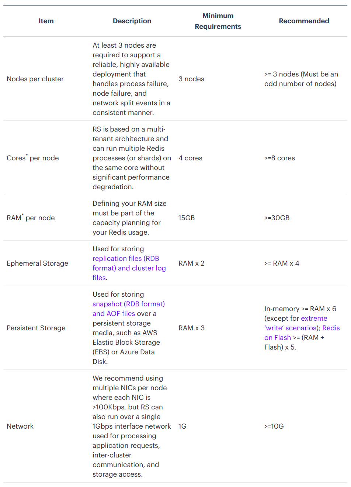
<br>
Получаем, что рекомендованно запустить от 3 машин,
с 8-ядерными процессорами, оперативной памятью от 30 ГБ,
постоянной памятью от 180 ГБ, памятью для репликации от 120 ГБ,
сетевым подключением от 10 Гбит/с.

Определим максимальный размер одной записи пользователя. Обратимся к части 2, пункту 3 и 6:
- Ежедневное преумножение данных: 390.23 МБ.
- Максимальный размер хранилища пользователя: 200.34 КБ, общее количество необходимых данных: пиковое количество пользователей (29 333 517) * 200.34 КБ = 5604.44 ГБ.


Произведем подбор машины:<br>
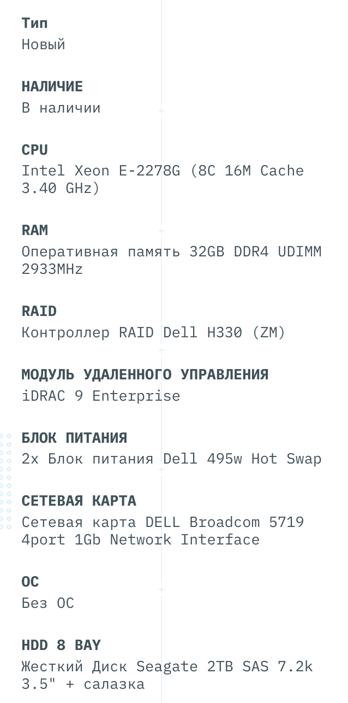<br>
Стоимость: 211 300 рублей

Оценим равномерное количество машин: 5604.44 ГБ / 1000 ГБ ~= 6<br>
Таким образом имеем 6 машин, на которых 1000 ГБ для постоянного хранения и 1000 ГБ для репликации.

#### Хранение данных объявлений с аппаратной точки зрения:
Для оценки аппаратной части СУБД обратимся к лучшим практикам PostgreSQL, так как в документации найти информацию не удалось.<br>

### Список источников:
1) <a href="https://www.similarweb.com/website/youla.ru/">Similarweb, страница о Юле</a>
2) <a href="https://sitechecker.pro/app/main/traffic-checker-land?pageUrl=https:%2F%2Fyoula.ru%2F">Sitechecker, страница о Юле</a>
3) <a href="https://docs.redislabs.com/latest/rs/administering/designing-production/hardware-requirements/">Redis labs, о кластере</a>
4) <a href="https://servermall.ru/config/dell-t340-8-3-5-/">Servermall, подбор сервера</a>