# Курсовая работа по дисциплине: Проектирование высоконагруженных систем (Highload_Ula).
## Тема: Юла

### Целевая аудитория

#### Распределение аудитории
| Страна      | Процент аудитории |  Количество пользователей в месяц   | Количество пользователей в день |
| :---        |    :----:   |        :----:   | ---:|
| Россия      | 85,9%       | 23 193 000   | 773 100 |
| Германия   | 4,3%       | 1 161 000      | 38 700 |
| Великобритания   | 	2,3%        | 621 000      | 20 700 |

- Количество активных пользователей в месяц: 27 млн человек.
- Средний возраст пользователей: от 18 до 35 лет.

#### Поведение пользователей (в рамках дня)
| Время на сайте      | Количество страниц за посещение | Количество размещений |  Отказы   |
| :---        |    :----:   |        :----:   | ---:|
| 7 минут | 6       | 0.25 | 42% |

### Расчет нагрузки

1) Оценка количества новых пользователей в день.
   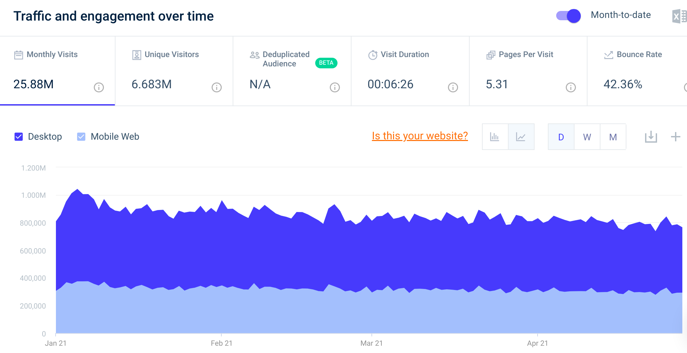
   - Рассмотрим количество пользователей в последние 6 месяцев
     
        | Октябрь__| Ноябрь___ | Декабрь__ |  Января___   | Февраль__   | Март_____  |
        | :---        |    :----:   | :----:   |:----:   | :----:   | ---:|
        | 29 333 517 | 27 481 394  | 28 038 666 | 27 083 573 | 23 196 570 | 24 892 581|
    
        Средний прирост в месяц:  ((28 038 666 - 27 481 394) + (24 892 581 - 23 196 570)) : 2 ~= 1 126 642 
        Средний прирост в день: 1 126 642 : 30 ~= 37 555 
        Регистируется каждый 10 пользователь, следовательно количество регистрацией в день: 3 756 
        Количество пользователей в день: 832 500, следовательно количество регистрацией в день на одного пользователя: 
        3 756 : 832 500 = 0.005
     

2) Рассмотрим усредненную пользовательскую модель действий в день:
    - авторизация - 1 раз
    - регистрация - 0.005 раз
    - Количество страниц за посещение - 6:
        - посещение главной страницы - 1 раз
        - посещение станицы категории - 2 раза
        - посещение станицы поиского запроса - 2 раза
        - посещение станицы мои объявления - 0.1 раза
        - посещение станицы мои заказы - 0.5 раза
        - посещение станицы кошелек - 0.1 раза
        - посещение станицы мои сообщения - 0.3 раза
    - отправка сообщений - 1
    - размещений - 0.25 раз
    

3) Оценка трафика
    - Авторизация 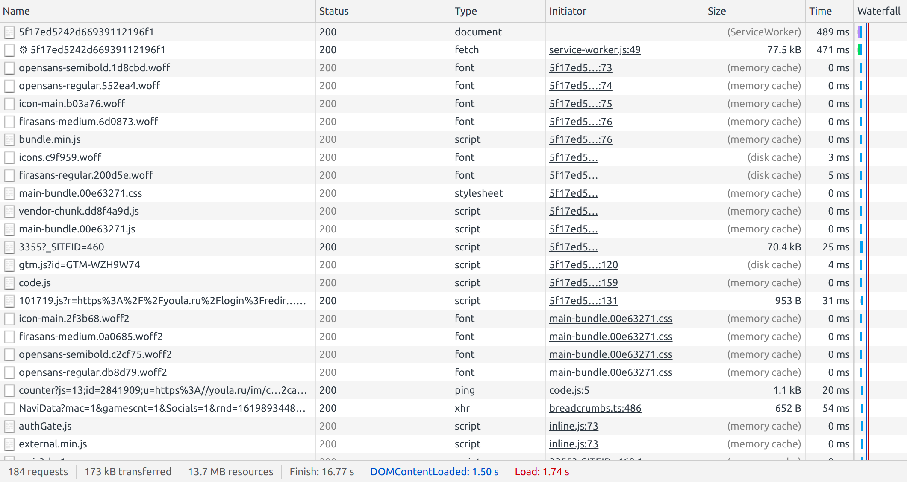 Объем трафика ~ 173 КБ, количество запросов: 184  
    - Регистрация 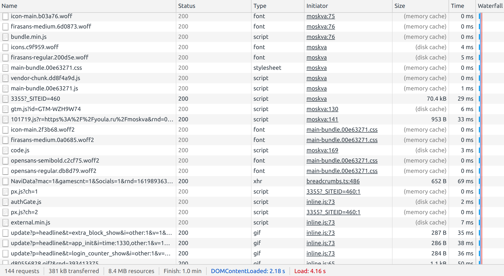 Объем трафика ~ 381 КБ, количество запросов: 144  
    - Главная страница 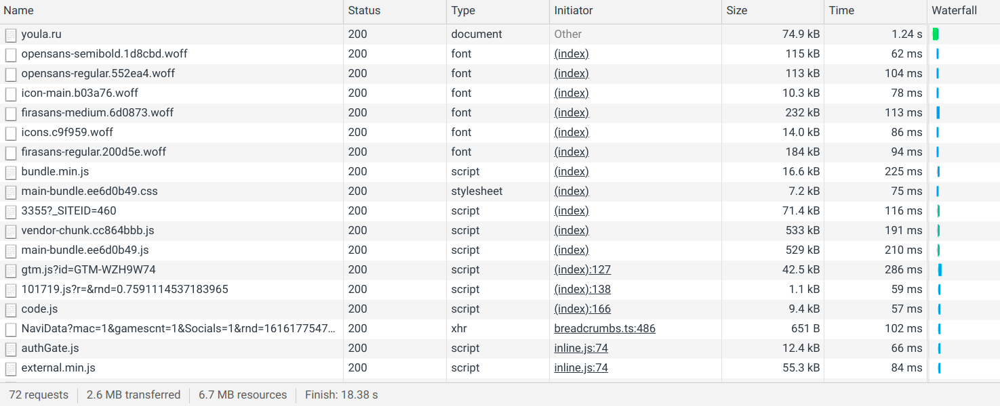 Объем трафика для посещения страницы ~ 2.6 МБ, количество запросов: 72  
    - Страница категории 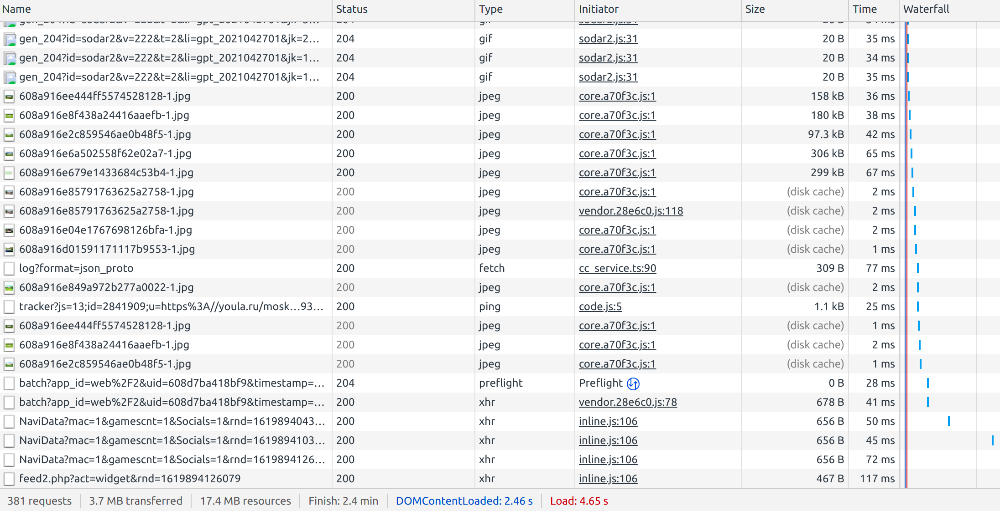 Объем трафика для посещения страницы ~ 3.7 МБ, количество запросов: 381  
    - Страница поиского запроса 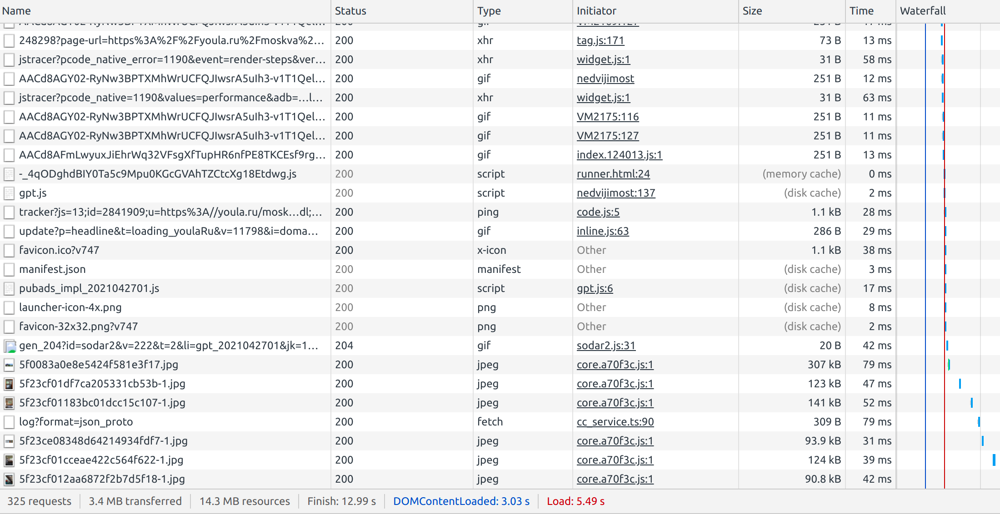 Объем трафика для посещения страницы ~ 3.4 МБ, количество запросов: 325  
    - Страница мои объявления 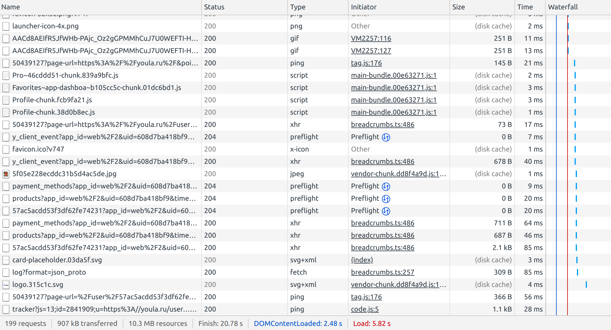 Объем трафика для посещения страницы ~ 907 КБ, количество запросов: 199  
    - Страница мои заказы 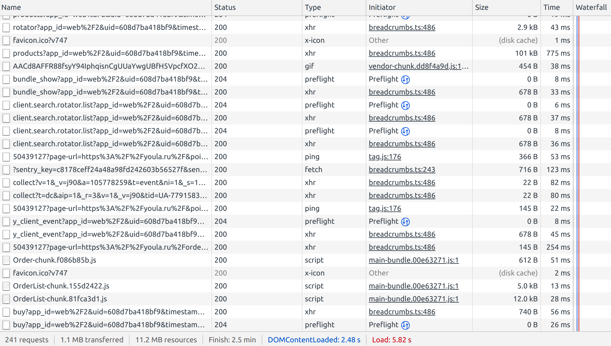 Объем трафика для посещения страницы ~ 1.1 МБ, количество запросов: 241  
    - Страница кошелек 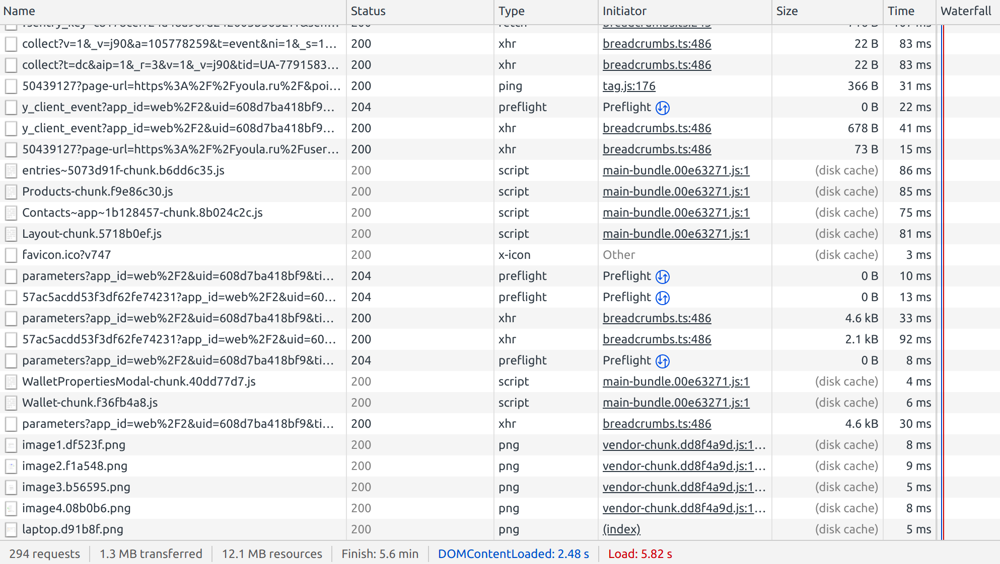 Объем трафика для посещения страницы ~ 1.3 МБ, количество запросов: 294  
    - Страница мои сообщения 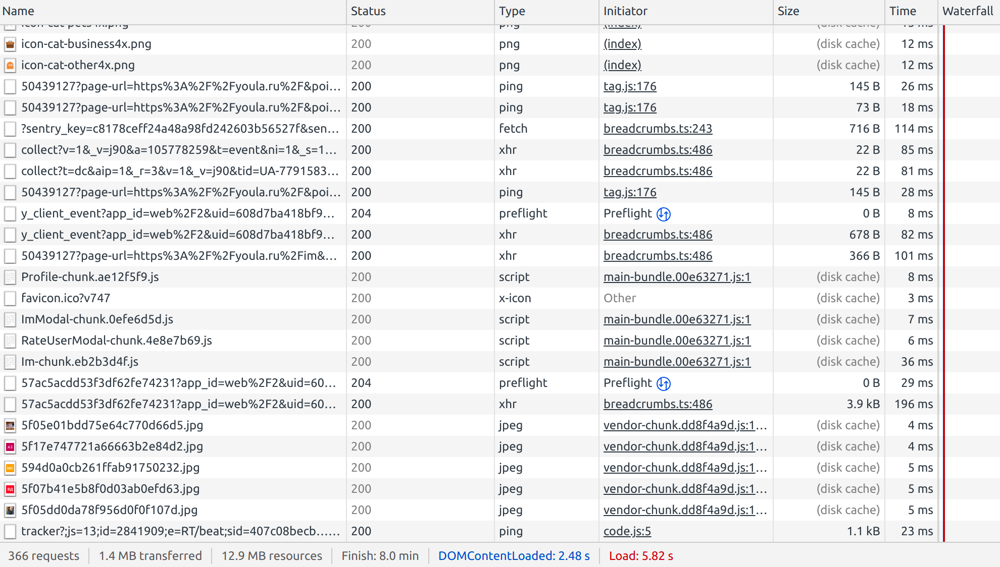 Объем трафика для посещения страницы ~ 1.4 МБ, количество запросов: 366  
    - Отправка сообщения 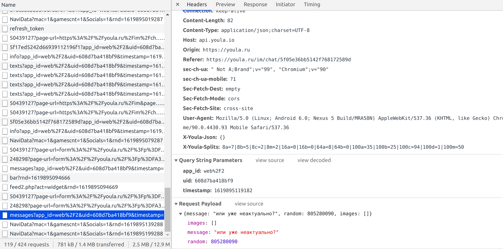  Объем трафика ~ 1 МБ, количество запросов: 1  
    - Отправка сообщения  Объем трафика ~ 5 МБ, количество запросов: 1211  

4) Расчет трафика для посещения страниц одного пользовател в день
    - 173 КБ * 1 = 173 КБ, 184 * 1 = 184 запроса
    - 381 КБ * 0.005 = 1.91 КБ, 144 * 0.005 = 184 запроса
    - 2.6 МБ * 1 = 2.6 МБ, 72 * 1 = 184 запроса
    - 3.7 МБ * 2 = 7.4 МБ, 381 * 2 = 184 запроса
    - 3.4 МБ * 2 = 6.8 МБ, 325 * 2 = 184 запроса
    - 907 КБ * 0.1 = 91 КБ, 199 * 0.1 = 184 запроса
    - 1.1 МБ * 0.5 = 550 КБ, 241 * 0.5 = 184 запроса
    - 1.3 МБ * 0.1 = 130 КБ, 294 * 0.1 = 184 запроса
    - 1.4 МБ * 0.3 = 420 КБ, 366 * 0.3 = 184 запроса
    - 1 МБ * 1 = 1 МБ, 1 * 1 = 184 запроса
    - 5 МБ * 0.25 = 1.25 МБ, 1211 * 0.25 = 184 запроса
    - <b>итого: 20.4 МБ</b>

5) Расчет дневного трафика
 - получаемый трафик 
   (2.6 МБ + 7.4 МБ + 6.8 МБ + 91 КБ + 550 КБ + 130 КБ + 420 КБ) * 832 500 = 15 313 171 500 КБ = 14.3 ТБ
 - передаваемый трафик 
   (173 КБ + 1.91 КБ + 1 МБ + 1.25 МБ) * 832 500 = 2 063 692 575 КБ = 1.9 ТБ

#### Итог по нагрузке:
- 14.3 ТБ получаемого трафика в день
- 1.9 ТБ передаваемого трафика в день

### Логическая схема БД
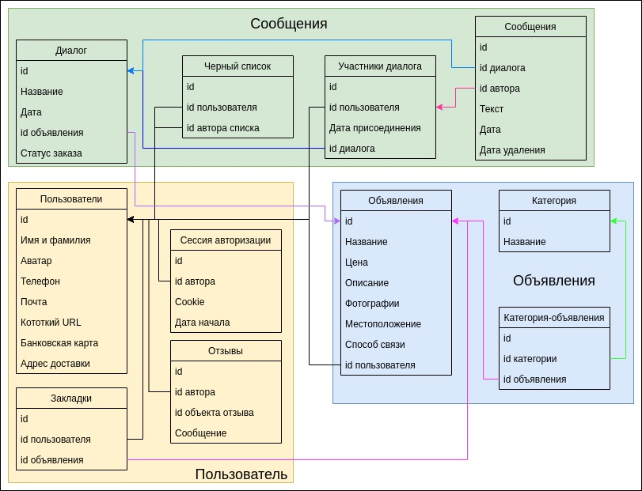

### Список источников:
1) <a href="https://www.similarweb.com/website/youla.ru/">similarweb, страница о Юле</a>
2) https://sitechecker.pro/app/main/traffic-checker-land?pageUrl=https:%2F%2Fyoula.ru%2F