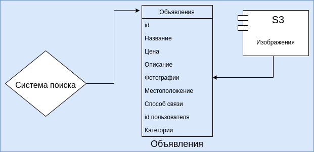

# Курсовая работа по дисциплине: Проектирование высоконагруженных систем (Highload_Ula).
## Тема: Юла

### 1. Целевая аудитория

#### Распределение аудитории
| Страна      | Процент аудитории |  Количество пользователей в месяц   | Количество пользователей в день |
| :---        |    :----:   |        :----:   | ---:|
| Россия      | 85,9%       | 23 193 000   | 773 100 |
| Германия   | 4,3%       | 1 161 000      | 38 700 |
| Великобритания   | 	2,3%        | 621 000      | 20 700 |

- Количество активных пользователей в месяц: 27 млн человек.
- Средний возраст пользователей: от 18 до 35 лет.


#### Поведение пользователей (в рамках дня)
| Время на сайте      | Количество страниц за посещение | Количество размещений |  Отказы   |
| :---        |    :----:   |        :----:   | ---:|
| 7 минут | 9       | 1 | 42% |

### 2. Расчет нагрузки

1) Оценка количества новых пользователей в день.
   
   - Рассмотрим количество пользователей в последние 6 месяцев
     
        | Октябрь<span style="color:white">__</span>| Ноябрь<span style="color:white">___</span> | Декабрь<span style="color:white">__</span> |  Января<span style="color:white">___</span>   | Февраль<span style="color:white">__</span>   | Март<span style="color:white">_____</span>  |
        | :---        |    :----:   | :----:   |:----:   | :----:   | ---:|
        | 29 333 517 | 27 481 394  | 28 038 666 | 27 083 573 | 23 196 570 | 24 892 581|
    
        Средний прирост в месяц:  ((28 038 666 - 27 481 394) + (24 892 581 - 23 196 570)) : 2 ~= 1 126 642<br>
        Средний прирост в день: 1 126 642 : 30 ~= 37 555<br>
        Регистируется каждый 10 пользователь, следовательно количество регистрацией в день: 3 756<br>
        Количество пользователей в день: 832 500, следовательно количество регистрацией в день на одного пользователя:<br>
        3 756 : 832 500 = 0.005
     

2) Рассмотрим усредненную пользовательскую модель действий в день:
   ```yaml
    - авторизация - 2 раз (4 запроса)
    - регистрация - 0.005 раз (0.02 запроса)
    - Количество страниц за посещение - 9:
        - посещение главной страницы - 1 раз (11 запросов)
        - посещение станицы категории - 2 раза (20 запросов)
        - посещение станицы поиского запроса - 2 раза (43 запроса)
        - посещение станицы мои объявления - 1 раз (9 запросов)
        - посещение станицы мои заказы - 1 раз (10 запросов)
        - посещение станицы кошелек - 1 раз (11 запросов)
        - посещение станицы мои сообщения - 1 раза (8 запрос)
    - отправка сообщений - 10 (25 запросов)
    - размещение - 1 раз (66 запросов)
   ```
   

3) Расчет среднего размера хранилища пользователя:
   ```yaml
   - профиль: 449 байт, учитывая максимальную заполняемость профиля, средняя заполняемость профиля 40% (180 байт)
   - количество объявления на пользователя: 0.15, максимальное количество объявления пользователя - 50<br>
     маскимальный размер одного объявления - 1006 байт, средний 400 байт, т.е. под объявления необходимо 50 * 1006 = 50300 байт максимально,<br>
     0.15 * 400 байт = 60 байт
   - закладки: размер одной закладки - 24 байт, максимальное количество закладок пользователя - 100, среднее 20<br>
     т.е. под закладки максимально необходимо 100 * 24 = 2400 байт, среднее 20 * 24 = 480 байт.
   - отзывы: маскимальный размер одного отзыва - 152 байт, максимальное количество отзывов пользователя - 1000, среднее 200 <br>
     т.е. под отзывы необходимо 1000 * 152 = 152000 байт, среднее 200 * 152 = 30400 байт.
   - итого:
      - максимальный размер хранилища пользователя: 449 байт + 50300 байт + 2400 байт + 152000 байт = 205 149 байт = 200.34 КБ
      - средний размер хранилища пользователя: 180 байт + 60 байт + 480 байт + 30400 байт = 31120 байт = 30.39 КБ
   ```
       
 
4) Оценка трафика получаемого от сервера статики
    - Авторизация  Объем трафика ~ 173 КБ * 2 = 346 КБ = 0.337 МБ, 184 запроса<br><br>
    - Регистрация  Объем трафика ~ 381 КБ * 0.005 = 1.905 КБ = 0.002 МБ, 144 запроса<br><br>
    - Главная страница  Объем трафика для посещения страницы ~ 2.6 МБ * 1 = 2.6 МБ, 72 запроса<br><br>
    - Страница категории  Объем трафика для посещения страницы ~ 3.7 МБ * 2 = 7.4 МБ, 381 запрос<br><br>
    - Страница поиского запроса  Объем трафика для посещения страницы ~ 3.4 МБ * 2 = 6.8 МБ, 325 запросов<br><br>
    - Страница мои объявления  Объем трафика для посещения страницы ~ 907 КБ * 1 = 907 КБ = 0.89 МБ, 199 запросов<br><br>
    - Страница мои заказы  Объем трафика для посещения страницы ~ 1.1 МБ * 1 = 1.1 МБ, 241 запрос<br><br>
    - Страница кошелек  Объем трафика для посещения страницы ~ 1.3 МБ * 1 = 1.3 МБ, 294 запрос<br><br>
    - Страница мои сообщения  Объем трафика для посещения страницы ~ 1.4 МБ * 1 = 1.4 МБ, 366 запросов<br><br>
    - Отправка сообщения  Объем трафика ~ 1 МБ * 10 = 10 МБ, 199 запросов<br><br>
    - Отправка объявления  Объем трафика ~ 5 МБ * 1 = 5 МБ, 48 запросов<br><br>
    
5) XHR запросы для одного пользовател в день
   ```yaml
    - Авторизация: 4 запроса
    - Регистрация: 0.02 запроса
    - Главная страница: 11 запрос
    - Страница категории: 20 запросов
    - Страница поиского запроса: 43 запросов
    - Страница мои объявления: 9 запрос
    - Страница мои заказы: 10 запрос
    - Страница кошелек: 11 запрос
    - Страница мои сообщения: 8 запрос
    - Отправка сообщения: 25 запросов
    - Отправка объявления: 66 запросов
    - Суммарно: 208 запросов
   ```

6) Расчет дискового пространства для одного пользовател в день:
   ```yaml
    - Регистрация: до 0.005 * 449 байт = 2.25 байт
    - Отправка сообщений: до 10 * 240 байт = 2400 байт
    - Отправка объявлений: до 1 * 1006 байт = 1006 байт
    - Итого: 3408.25 байт = 3.33 КБ
   ```
    

7) Расчет дневного трафика
   ```yaml
    - сервер статики
      трафик: (0.337 МБ + 0.002 МБ + 2.6 МБ + 7.4 МБ + 6.8 МБ + 0.89 МБ + 1.1 МБ + 1.3 МБ + 1.4 МБ + 10 МБ + 5 МБ) * 832 500 = 30 660 142.5 МБ = 29.24 ТБ
      запросы: (184 + 144 + 72 + 381 + 325 + 199 + 241 + 294 + 366 + 199 + 48) * 832 500 = 2 042 122 500 запросов
       
    - XHR запросы
      GET: 11 + 20 + 43 + 9 + 10 + 11 + 8 = 112
      POST: 4 + 0.02 + 25 + 66 = 96 запросов
      Поиск: 43 * 832 500 = 35 797 500 запросов
      итого: 208 * 832 500 = 173 160 000 запросов
   ```

8) Оценка нагрузки на клиентский сервер в теченнии суток<br>
   ```yaml
    - трафик в секунду: (30 660 142.5 МБ / 125) Гбит / (24 * 3 600) секунд = 2.84 Гбит/с
    - RPS: 2 042 122 500 / (24 * 3 600) секунд = 23 635.7 запросов в секунду
   ```

9) Оценка нагрузки на бэкенд сервер в теченнии суток<br>
   ```yaml
      - GET: (112 * 832 500) запросов / (24 * 3 600) секунд = 1079.2 запросов в секунду
      - POST: (96 * 832 500) запросов / (24 * 3 600) секунд = 925 запросов в секунду
      - Поиск: 35 797 500 запросов / (24 * 3 600) секунд = 415 запросов в секунду
      - итого: 173 160 000 запросов / (24 * 3 600) секунд = 2004.2 запросов в секунду
   ```
    
#### Итог по нагрузке:
```yaml
  - клиентский сервер: 2.84 Гбит/с, 23 635.7 запросов в секунду
  - бэкенд сервер: 2004.2 запросов в секунду
```

### 3. Логическая схема БД


### 4. Физическая схема БД

#### Общая политика хранения данных:
Данный сервис будет хранить данные, которые имеют неограниченную и ограниченную актуальность. Специфика сервиса подразумевает создание объявлений.
Данный процесс является рутинным, пользователи без интереса заполняют объвления и не ценят полученный результат. Пользователи с большой вероятностью
не буду удалять неактуальные объявления. В таких условиях необходимо задать сроки хранения и сроки архивирования данных.
Данные по типам актуальности:
- неограниченной актуальности - данные пользователей, закладки, отзывы, сообщения, категории
- ограниченной актуальности - объявления, связи категории-объявления.

#### Хранение данных пользователя:
Данные пользователя должны храниться относительное долгое время. Конечно, можно ввести время максимального бездействия,
после которого аккаунт будет заморожен. Для MVP продукта предлается хранить аккаунт пользователя с его закладками
и сообщениями 5 лет с момента последнего посещения сервиса.

В интерфейсе нашего приложения личный кабинет, закладки, отзывы и сообщения находятся довольно близко, что побудит пользователя
часто запрашивать эти виды информации в небольшом интервале времени. Предлагается для хранения данных пользователя использовать базу данных PostgreSQL, в том числе использовать кластер.

   - Таблица пользователи
     
  | id | Имя и фамилия | Аватар |  Телефон | Почта | Короткий url | Банковская карта | Адрес доставки | Хэш пароля |
  | :---        |    :----:   | :----:   |:----:   | :----:   | :----:   | :----:   | :----:   | ---:|
  | bigint | varchar(40) | varchar(40), название файла в S3 | varchar(13) | varchar(30) | varchar(30) | varchar(60)| varchar(100)|  varchar(128)|

   Максимальный размер одного пользователя: 8 байт + 40 байт + 40 байт + 13 байт + 30 байт + 30 байт + 60 байт + 100 байт + 128 байт = 449 байт = 0.44 КБ, средний: 0.22 КБ.

  - Таблица закладки

   | id | id пользователя | id объявления |
   | :---  |    :----:   | ---:|
   | bigint | bigint  | bigint  |

   Максимальный размер одной закладки: 8 байт + 8 байт + 8 байт = 24 байт = 0.023 КБ, средний: 0.012 КБ

   - Таблица отзывы

   | id | id автора | Cookie | Дата начала |
   | :---  |    :----:   | :----:   | ---:|
   | bigint | bigint  | varchar(128)  |  timestamp  |

   Максимальный размер одного отзыва: 8 байт + 8 байт + 128 байт + 8 байт = 152 байт = 0.15 КБ, средний: 0.8 КБ

   - Таблица диалог

   | id | Название | Дата | id объявления | Статус заказа |
   | :--- | :----:   | :----:   | :----:   | ---:|
   | bigint | varchar(20) | timestamp  |  bigint | enum(5 * varchar(10)) |

   Максимальный размер одного диалога: 8 байт + 20 байт + 8 байт + 8 байт + 50 байт = 94 байт = 0.092 КБ, средний: 0.046 КБ

   - Таблица черный список

   | id | id пользователя | id автора списка | 
   | :--- |    :----:   |  ---:|
   | bigint | bigint  | bigint  |

   Максимальный размер одной записи черного списока: 8 байт + 8 байт + 8 байт = 24 байт = 0.023 КБ

   - Таблица сообщения

   | id | id диалога | id автора | Текст | Дата | Дата удаления |
   | :--- | :----:   | :----:   | :----:   | :----:   | ---:|
   | bigint | bigint | bigint  |  varchar(200)| timestamp | timestamp |

   Максимальный размер одного сообщения: 8 байт + 8 байт + 8 байт + 200 байт + 8 байт + 8 байт = 240 байт = 0.23 КБ

_Расчет дискового пространства_<br>
Максимальное количество пользователей: 29 333 517.
```yaml
    -суммарный объем таблицы пользоватеи: 29 333 517 * 0.22 КБ = 6 453 373.74 КБ
    -суммарный объем таблицы закладки: 29 333 517 * 10 * 0.012 КБ = 3 520 022.04 КБ
    -суммарный объем таблицы отзывы: 29 333 517 * 5 * 0.8 КБ = 117 334 068 КБ
    -суммарный объем таблицы диалоги: 29 333 517 * 10 * 0.046 КБ = 13 493 417.82 КБ
    -суммарный объем таблицы черный список: 29 333 517 * 10 * 0.023 КБ = 6 746 708.91 КБ
    -суммарный объем таблицы сообщения: 29 333 517 * 40 * 0.23 КБ = 269 868 356.4 КБ
    -суммарный итог: 417 415 946.9 КБ = 400 ГБ, столько же для реплекации
    -QPS: 2004.2 запросов в секунду
```

_Физическая сзема хранения данных пользователя:_


#### Хранение данных сессий:
Для храненения сессий будет использован Redis.<br>
Условная схема хранения без деталей реализации. Пара «ключ — значение».<br>
- <b>Ключ:</b> Cookie, email, пароль пользователя.<br>
- <b>Значение:</b> JSON-подобный объект, создержащий данные сессии. Пример:<br>
   ```yaml
         {
              "id автора": 74654,
              "Cookie": "H3MIghjffytfkuq_wM/APigygguwF2BwFe",
              "Дата начала": "2021-04-21T18:25:43-05:00"
         }
   ```
  _Расчет дискового пространства_<br>
  ```yaml
    -размер записи: 128 байт + 40 байт + 128 байт + 8 байт + 128 байт + 8 байт = 440 байт
    -объем базы: 832 500 * 440 байт = 366  300 000 байт = 349.3 МБ
    -QPS: 2004.2 запросов в секунду
  ```

#### Хранение данных объявлений:
Массив объявлений предполагает различные выборки по категории, названию, дате, пользователю, цене, местоположению и так далее,
поэтому предпалагается использовать реляционную структуру хранения.<br>
Схема хранения. Предлагается использовать одну таблицу - объявления.<br>
Таблицы категории и категории-объявления заменим на денормализованные колонки таблицы объявления, что позволит оптимизировать запросы.<br>
Индексы на другие колонки будут приводить к излишним затратам их создание, поэтому они не будут использованы.

Пример записи:

| id | Название | Цена |  Описание | Фотографии | Местоположение | Способ связи | Дата публикации | id пользователя | Категории |
| :---  | :----:   | :----:   |:----:   | :----:   | :----:   | :----:   | :----:  |  :----:  | ---:|
| 8567 | Продается Юла | 3000 рублей | В хорошем состоянии  | ['url(...)', 'url(...)'] | м. Бауманская | +79999999999| 2021-04-21T18:25:43-05:00 | 3958 |['Недвижимость', 'Автомобили'] |

Данная структура позволяет делать выборку по значению колонки или комбинации колонок.<br>

Оценим размер базы объявлений.
```yaml
Всего объявлений: 0.9 * 29 333 517 = 26 400 165.3 объявлений.<br>
Максимальный размер записи: 1006 байт + 28 байт + 24 байт = 1058 байт, среднии- 529 байт<br>
Для хранения объявлений необходимо: 26 400 165.3 * 529 байт = 13 965 687 443.7 байт = 13 Тб, столько же для реплекации
Необходимый QPS: 2004.2
```

Для балансировки количества объявления в базе и монетизации сервиса предлагается<br> 
хранить объявления 2 недели в бесплатном тарифе и 4 недели в платном тарифе, далее архивировать.<br>

<i>Забегая вперед, не учитываются изображения, так как они будут храниться в S3.</i>
С точки зрения реализации предпалагается использовать PostgreSQL с шардированием.<br>

Наиболее загруженная точка сервиса - это поиск по объявлениям. По моим оценка full scan таблицы объявлений будет занимать примерно 1 минуту, что недопустимо.
<br>
<br>

_Рассмторим оптимизацию посредством модуля поиска_<br>
Для реализации модуля поиска будет использован Seekstorm — библиотека для высокопроизводительного полнотекстового поиска.<br>
Как Lucene, только быстрее:

Необходимый QPS для поиска - 415, Seekstorm покрывает эту производительность.

В данный модуль будут реплицироваться колонки базы, по которым будет вестись поиск, а также id, для дальнейшего вычитывания.<br>
Модель внутри модуля поиска:
```yaml
     static Document Объявления(Объявление объявление)
     {
       var объявление = new Объявление();
       объявление.Add(new NumericField("Id", Field.Store.YES, true).SetIntValue(объявление.Id));
       объявление.Add(new Field("Название", объявление.Название, Field.Store.YES, Field.Index.ANALYZED));
       объявление.Add(new Field("Категории", объявление.Категории, Field.Store.YES, Field.Index.ANALYZED));
       объявление.Add(new Field("Цена", объявление.Цена, Field.Store.YES, Field.Index.ANALYZED));
       return объявление;
     }
   ```

Расчет дискового пространства:
```yaml
-По результатам поиска id будет получен id нужного объявления, после чего оно будет вычитано из основой объявлений.
-Размер записи: bigint(8 байт) + varchar(40) + varchar(30) * 5 + varchar(15) = 213 байт.
-Размер всего хранилища: 213 байт * 26 400 165.3 объявлений = 5.24 Гб.
-QPS: 415
```

Хранение изображений объявлений будет храниться в S3, так как оно обеспечивает надежность, доступность и масштабируемость.<br>
```yaml
  -По условия сервиса разрешено хранить изображения: до 2 Мб
  -Среднее количество изображений объявления: 1
  -При 30 000 000 объявлений получаем: 30 000 000 * 2 Мб = 28.61 Тб (реплекация предусмотрена провайдером)
  -Необходимый RPS: 2004.2 (пример, Amazon дает 3 500 RPS )
```

Общая схема блока объявлений:<br>

<br>
<br>

Общий вид физической схемы БД:


### 5. Выбор технологий

#### Технологии
```yaml
- фронтенд: React TypeScript, так как данная технология обеспечивает оптимальный рендеринг DOM-дерева, также есть типизация
- бэкенд: Golang, язык от компании Google, который специально создан для бэкенда, содержит многопоточность и микросервисную архитектру, также является очень безопасным
- клиенсткий сервер: nginx, стандарт сервера, обладает оптимизацией распределения нагрузки и механизмами балансирования нагрузки.
```

#### Сервер статики.
Будет использован Nginx. Будет использован машина на 16 ядер. Для нее получаем:
```yaml
- пропускная способность: 48 Гбит/сек
- количество одновременных соединений: 50 000
- CPS: 6 676
- RPS: 77 427 RPS
```
CPS:


Средний разбор запроса 30 Кб<br>
Для системы будет достаточно 4-ых 16-ядерных машин.

#### Сервер бекенд
16 ядер + 64 Гб машина с Golang приложением при относительно простых запросах:
```yaml
-RPS: 3500 запросов в секунду
-поддержка активных подключений: 500 000 
```

Учитывая 832 500 пользователей и 2004.2 RPS, делаем выводы:
```yaml
1: Перед базой пользователей надо поставить одну машину с 1 ТБ SSD диском (данные сессий)
2: Перед базой объявлений надо поставить 2 машины с 1 ТБ SSD диском (данные сессий)
```

#### Машина пользователей
Для PostgreSQL машины 16 ядер + 64 Гб:
```yaml
RPS: 2500 запросов в секунду
подключения: до 10 000
каждая машина содержит группу: 1 машина для записи и 2 машины для чтения
```
Учитывая 2004.2 RPS, задержки, 832 500 пользоватлей, делаем выводы:<br>
перед пользователем ставим 2 машины с диском по 500 Гб SSD (данные и репликация), применяется шардирование.

#### Машина объявлений
Для PostgreSQL машины 16 ядер + 64 Гб с максимальными оптимизациями:
```yaml
RPS: 2500 запросов в секунду
подключения: до 10 000
каждая машина содержит группу: 1 машина для записи и 2 машины для чтения
```
Учитывая 2004.2 RPS, 415 RPS для поиска, задержки, 832 500 пользоватлей, делаем выводы:<br>
перед объявлениями ставим 4 машины с диском по 4 * 2 Тб SSD (данные и репликация), применяется шардирование.

#### Расположение оборудования
Учитывая географию пользователей, оптимально размесить оборудование в Москве.

### Схема проекта


### Список источников:
1) <a href="https://www.similarweb.com/website/youla.ru/">Similarweb, страница о Юле</a>
2) <a href="https://sitechecker.pro/app/main/traffic-checker-land?pageUrl=https:%2F%2Fyoula.ru%2F">Sitechecker, страница о Юле</a>
3) <a href="https://docs.redislabs.com/latest/rs/administering/designing-production/hardware-requirements/">Redis labs, о кластере</a>
4) <a href="https://servermall.ru/config/dell-t340-8-3-5-/">Servermall, подбор сервера</a>
5) <a href="https://seekstorm.com/">Seekstorm</a>
6) <a href="https://www.nginx.com/blog/testing-the-performance-of-nginx-and-nginx-plus-web-servers/">Nginx производительность</a>
7) <a href="https://www.ashnik.com/fine-tuning-postgres-to-achieve-5000-queries-per-second/">PostgreSQL производительность</a>