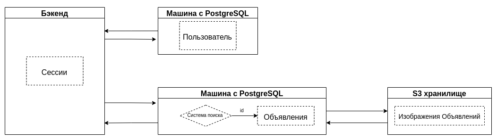

# Курсовая работа по дисциплине: Проектирование высоконагруженных систем (Highload_Ula).
## Тема: Юла

### 1. Целевая аудитория

#### Распределение аудитории
| Страна      | Процент аудитории |  Количество пользователей в месяц   | Количество пользователей в день |
| :---        |    :----:   |        :----:   | ---:|
| Россия      | 85,9%       | 23 193 000   | 773 100 |
| Германия   | 4,3%       | 1 161 000      | 38 700 |
| Великобритания   | 	2,3%        | 621 000      | 20 700 |

- Количество активных пользователей в месяц: 27 млн человек.
- Средний возраст пользователей: от 18 до 35 лет.


#### Поведение пользователей (в рамках дня)
| Время на сайте      | Количество страниц за посещение | Количество размещений |  Отказы   |
| :---        |    :----:   |        :----:   | ---:|
| 7 минут | 6       | 0.25 | 42% |

### 2. Расчет нагрузки

1) Оценка количества новых пользователей в день.
   
   - Рассмотрим количество пользователей в последние 6 месяцев
     
        | Октябрь<span style="color:white">__</span>| Ноябрь<span style="color:white">___</span> | Декабрь<span style="color:white">__</span> |  Января<span style="color:white">___</span>   | Февраль<span style="color:white">__</span>   | Март<span style="color:white">_____</span>  |
        | :---        |    :----:   | :----:   |:----:   | :----:   | ---:|
        | 29 333 517 | 27 481 394  | 28 038 666 | 27 083 573 | 23 196 570 | 24 892 581|
    
        Средний прирост в месяц:  ((28 038 666 - 27 481 394) + (24 892 581 - 23 196 570)) : 2 ~= 1 126 642<br>
        Средний прирост в день: 1 126 642 : 30 ~= 37 555<br>
        Регистируется каждый 10 пользователь, следовательно количество регистрацией в день: 3 756<br>
        Количество пользователей в день: 832 500, следовательно количество регистрацией в день на одного пользователя:<br>
        3 756 : 832 500 = 0.005
     

2) Рассмотрим усредненную пользовательскую модель действий в день:
    - авторизация - 2 раз (2 запроса)
    - регистрация - 0.005 раз (0.01 запроса)
    - Количество страниц за посещение - 9:
        - посещение главной страницы - 1 раз (1 запрос)
        - посещение станицы категории - 2 раза (20 запросов)
        - посещение станицы поиского запроса - 2 раза (15 запросов)
        - посещение станицы мои объявления - 1 раз (1 запрос)
        - посещение станицы мои заказы - 1 раз (1 запрос)
        - посещение станицы кошелек - 1 раз (1 запрос)
        - посещение станицы мои сообщения - 1 раза (1 запрос)
    - отправка сообщений - 10 (10 запросов)
    - размещение - 1 раз (4 запроса)
   
3) Расчет среднего размера хранилища пользователя:
   - профиль: 449 байт, учитывая максимальную заполняемость профиля, средняя заполняемость профиля 40% (180 байт)
   - количество объявления на пользователя: 0.15, максимальное количество объявления пользователя - 50<br>
     маскимальный размер одного объявления - 1006 байт, средний 400 байт, т.е. под объявления необходимо 50 * 1006 = 50300 байт максимально,<br>
     0.15 * 400 байт = 60 байт
   - закладки: размер одной закладки - 24 байт, максимальное количество закладок пользователя - 100, среднее 20<br>
     т.е. под закладки максимально необходимо 100 * 24 = 2400 байт, среднее 20 * 24 = 480 байт.
   - отзывы: маскимальный размер одного отзыва - 152 байт, максимальное количество отзывов пользователя - 1000, среднее 200 <br>
     т.е. под отзывы необходимо 1000 * 152 = 152000 байт, среднее 200 * 152 = 30400 байт.
   - <b>итого:
      - максимальный размер хранилища пользователя: 449 байт + 50300 байт + 2400 байт + 152000 байт = 205 149 байт = 200.34 КБ
      - средний размер хранилища пользователя: 180 байт + 60 байт + 480 байт + 30400 байт = 31120 байт = 30.39 КБ
     </b>
        
4) Оценка трафика получаемого от сервера статики
    - Главная страница  Объем трафика для посещения страницы ~ 2.6 МБ<br><br>
    - Страница категории  Объем трафика для посещения страницы ~ 3.7 МБ<br><br>
    - Страница поиского запроса  Объем трафика для посещения страницы ~ 3.4 МБ<br><br>
    - Страница мои объявления  Объем трафика для посещения страницы ~ 907 КБ<br><br>
    - Страница мои заказы  Объем трафика для посещения страницы ~ 1.1 МБ<br><br>
    - Страница кошелек  Объем трафика для посещения страницы ~ 1.3 МБ<br><br>
    - Страница мои сообщения  Объем трафика для посещения страницы ~ 1.4 МБ<br><br>
    
5) Оценка трафика передаваемого в XHR запросах:
    - Авторизация  Объем трафика ~ 173 КБ<br><br>
    - Регистрация  Объем трафика ~ 381 КБ<br><br>
    - Отправка сообщения   Объем трафика ~ 1 МБ<br><br>
    - Отправка объявления  Объем трафика ~ 5 МБ<br><br>

6) XHR запросы для одного пользовател в день
    - Авторизация: 2 запроса
    - Регистрация: 0.01 запроса
    - Главная страница: 1 запрос
    - Страница категории: 20 запросов
    - Страница поиского запроса: 15 запросов
    - Страница мои объявления: 1 запрос
    - Страница мои заказы: 1 запрос
    - Страница кошелек: 1 запрос
    - Страница мои сообщения: 1 запрос
    - Отправка сообщения: 10 запросов
    - Отправка объявления: 4 запроса
    - <b>56 запроса</b>
    

7) Расчет дискового пространства для одного пользовател в день:
    - Регистрация: до 0.005 * 449 байт = 2.25 байт
    - Отправка сообщений: до 10 * 240 байт = 2400 байт
    - Отправка объявлений: до 1 * 1006 байт = 1006 байт
    - <b>Итого: 3408.25 байт = 3.33 КБ</b>
    

8) Расчет дневного трафика
    - получаемый трафик<br>
      сервер статики: (2.6 МБ + 7.4 МБ + 6.8 МБ + 91 КБ + 550 КБ + 130 КБ + 420 КБ) * 832 500 = 15 313 171 500 КБ = 14.3 ТБ<br>
      XHR запросы: 1 + 20 + 15 + 1 + 1 + 1 + 1 = 40 запросов
       
    - передаваемый трафик<br>
      XHR запросы: (173 КБ + 1.91 КБ + 1 МБ + 1.25 МБ) * 832 500 = 2 063 692 575 КБ = 1.9 ТБ<br>
      XHR запросы: 2 + 0.01 + 10 + 4 = 16 запроса
      

9) Оценка существенных запросов<br>
   - Авторизация: (2 * 832 500) запросов : (24 * 3 600) секунд = 19.27 запросов в секунду
   - Регистрация: (0.01 * 832 500) запросов : (24 * 3 600) секунд = 0.1 запросов в секунду
   - Главная страница: (1 * 832 500) запросов : (24 * 3 600) секунд = 9.64 запросов в секунду
   - Страница категории: (20 * 832 500) запросов : (24 * 3 600) секунд = 192.7 запросов в секунду
   - Страница поиского запроса: (15 * 832 500) запросов : (24 * 3 600) секунд = 144.53 запросов в секунду
   - Страница мои объявления: (1 * 832 500) запросов : (24 * 3 600) секунд = 9.64 запросов в секунду
   - Страница мои заказы: (1 * 832 500) запросов : (24 * 3 600) секунд = 9.64 запросов в секунду
   - Страница кошелек: (1 * 832 500) запросов : (24 * 3 600) секунд = 9.64 запросов в секунду
   - Страница мои сообщения: (1 * 832 500) запросов : (24 * 3 600) секунд = 9.64 запросов в секунду
   - Отправка сообщения: (10 * 832 500) запросов : (24 * 3 600) секунд = 96.35 запросов в секунду
   - Отправка объявления: (4 * 832 500) запросов : (24 * 3 600) секунд = 38.54 запросов в секунду


10) Суммарный суточный трафик запросов к серверу статики <br>
      - Главная страница: 2.6 МБ * 832 500 = 2113.77 Гбайт/сутки
      - Страница категории: 7.4 МБ * 832 500 = 6016.11 Гбайт/сутки
      - Страница поиского запроса: 6.8 МБ * 832 500 5528.32 Гбайт/сутки
      - Страница мои объявления: 91 КБ * 832 500 = 72.25 Гбайт/сутки
      - Страница мои заказы: 550 КБ * 832 500 = 436.66 Гбайт/сутки
      - Страница кошелек: 130 КБ * 832 500 = 103.21 Гбайт/сутки
      - Страница мои сообщения: 420 КБ * 832 500 = 333.45 Гбайт/сутки
    

11) Суммарный суточный трафик запросов XHR запросов <br>
        - Авторизация: 173 КБ * 832 500 = 137.35 Гбайт/сутки
        - Регистрация: 1.91 КБ * 832 500 = 1.52 Гбайт/сутки
        - Отправка сообщения: 1 МБ * 832 500 = 812.98 Гбайт/сутки
        - Отправка объявления: 1.25 МБ * 832 500 = 1016.24 Гбайт/сутки


12) Пиковая оценка запросов в теченнии суток<br>
      - GET: (40 * 832 500) запросов : (23 * 3 600) секунд = 402.17 запросов в секунду
      - POST: (16 * 832 500) запросов : (23 * 3 600) секунд = 160.87 запросов в секунду


13) Оценка пикового потребления в теченнии суток<br>
      - получаемый трафик: (15 313 171 500 КБ : 125 000) Гбит : (23 * 3 600) секунд = 1.48 Гбит/с
      - передаваемый трафик: (2 063 692 575 КБ : 125 000) Гбит : (23 * 3 600) секунд = 0.2 Гбит/с
      
#### Итог по нагрузке:
- получаемый трафик: 1.48 Гбит/с, 402.17 GET-запросов в секунду
- передаваемый трафик: 0.2 Гбит/с, 160.87 POST-запросов в секунду

### 3. Логическая схема БД


### 4. Физическая схема БД
   - Таблица пользователи
     
  | id | Имя и фамилия | Аватар |  Телефон | Почта | Короткий url | Банковская карта | Адрес доставки | Хэш пароля |
  | :---        |    :----:   | :----:   |:----:   | :----:   | :----:   | :----:   | :----:   | ---:|
  | bigint | varchar(40) | varchar(40), название файла в S3 | varchar(13) | varchar(30) | varchar(30) | varchar(60)| varchar(100)|  varchar(128)|

   Максимальный размер одного пользователя: 8 байт + 40 байт + 40 байт + 13 байт + 30 байт + 30 байт + 60 байт + 100 байт + 128 байт = 449 байт = 0.44 КБ, средний: 0.22 КБ.

  - Таблица закладки

   | id | id пользователя | id объявления |
   | :---  |    :----:   | ---:|
   | bigint | bigint  | bigint  |

   Максимальный размер одной закладки: 8 байт + 8 байт + 8 байт = 24 байт = 0.023 КБ, средний: 0.012 КБ

   - Таблица отзывы

   | id | id автора | Cookie | Дата начала |
   | :---  |    :----:   | :----:   | ---:|
   | bigint | bigint  | varchar(128)  |  timestamp  |

   Максимальный размер одного отзыва: 8 байт + 8 байт + 128 байт + 8 байт = 152 байт = 0.15 КБ, средний: 0.8 КБ

   - Таблица диалог

   | id | Название | Дата | id объявления | Статус заказа |
   | :--- | :----:   | :----:   | :----:   | ---:|
   | bigint | varchar(20) | timestamp  |  bigint | enum(5 * varchar(10)) |

   Максимальный размер одного диалога: 8 байт + 20 байт + 8 байт + 8 байт + 50 байт = 94 байт = 0.092 КБ, средний: 0.046 КБ

   - Таблица черный список

   | id | id пользователя | id автора списка | 
   | :--- |    :----:   |  ---:|
   | bigint | bigint  | bigint  |

   Максимальный размер одной записи черного списока: 8 байт + 8 байт + 8 байт = 24 байт = 0.023 КБ

   - Таблица сообщения

   | id | id диалога | id автора | Текст | Дата | Дата удаления |
   | :--- | :----:   | :----:   | :----:   | :----:   | ---:|
   | bigint | bigint | bigint  |  varchar(200)| timestamp | timestamp |

   Максимальный размер одного сообщения: 8 байт + 8 байт + 8 байт + 200 байт + 8 байт + 8 байт = 240 байт = 0.23 КБ


#### Общая политика хранения данных:
   Данный сервис будет хранить данные, которые имеют неограниченную и ограниченную актуальность. Специфика сервиса подразумевает создание объявлений. 
   Данный процесс является рутинным, пользователи без интереса заполняют объвления и не ценят полученный результат. Пользователи с большой вероятностью 
   не буду удалять неактуальные объявления. В таких условиях необходимо задать сроки хранения и сроки архивирования данных.
   Данные по типам актуальности:
   - неограниченной актуальности - данные пользователей, закладки, отзывы, сообщения, категории
   - ограниченной актуальности - объявления, связи категории-объявления.

#### Хранение данных сессий:
Условная схема хранения без деталей реализации. Пара «ключ — значение».<br>
- <b>Ключ:</b> Cookie, email, пароль пользователя.<br>
- <b>Значение:</b> JSON-подобный объект, создержащий данные сессии. Пример:<br>
   ```yaml
         {
              "id автора": 74654,
              "Cookie": "H3MIghjffytfkuq_wM/APigygguwF2BwFe",
              "Дата начала": "2021-04-21T18:25:43-05:00"
         }
   ```
Чтобы увеличить размер базы данных и повысить скорость поиска нужно распределить
данные по нескольким серверам посредством шардирования.
В качестве реализации предлагается использовать Redis Cluster.<br>

Распредление записей пользователей производится посредством хэширования.<br>
Для каждого ключа вычисляется хэш-функция,
полученное значение берется по модулю числа узлов.<br>

Результат — номер сервера, на котором будет хранится запись.<br>


#### Хранение данных пользователя:
   Данные пользователя должны храниться относительное долгое время. Конечно, можно ввести время максимального бездействия, 
   после которого аккаунт будет заморожен. Для MVP продукта предлается хранить аккаунт пользователя с его закладками 
   и сообщениями 5 лет с момента последнего посещения сервиса.

   В интерфейсе нашего приложения личный кабинет, закладки, отзывы и сообщения находятся довольно близко, что побудит пользователя
   часто запрашивать эти виды информации в небольшом интервале времени. Предлагается для хранения данных пользователя использовать базу данных PostgreSQL, в том числе использовать кластер. 

Физическая сзема хранения данных пользователя:


#### Хранение данных объявлений:
Массив объявлений предполагает различные выборки по категории, названию, дате, пользователю, цене, местоположению и так далее,
поэтому предпалагается использовать реляционную структуру хранения.<br>
Схема хранения. Предлагается использовать одну таблицу - объявления.<br>
Таблицы категории и категории-объявления заменим на денормализованные колонки таблицы объявления, что позволит оптимизировать запросы.<br>
Индексы на другие колонки будут приводить к излишним затратам их создание, поэтому они не будут использованы.

Пример записи:

| id | Название | Цена |  Описание | Фотографии | Местоположение | Способ связи | Дата публикации | id пользователя | Категории |
| :---  | :----:   | :----:   |:----:   | :----:   | :----:   | :----:   | :----:  |  :----:  | ---:|
| 8567 | Продается Юла | 3000 рублей | В хорошем состоянии  | ['url(...)', 'url(...)'] | м. Бауманская | +79999999999| 2021-04-21T18:25:43-05:00 | 3958 |['Недвижимость', 'Автомобили'] |

Данная структура позволяет делать выборку по значению колонки или комбинации колонок.<br>

Оценим размер базы объявлений. Всего объявлений: 0.9 * 29 333 517 = 26 400 165.3 объявлений.<br>
Максимальный размер записи: 1006 байт + 28 байт + 24 байт = 1058 байт, среднии: 529 байт<br>
Для хранения объявлений необходимо: 26 400 165.3 * 529 байт = 13 965 687 443.7 байт = 13 Гб

Для балансировки количества объявления в базе и монетизации сервиса предлагается<br> 
хранить объявления 2 недели в бесплатном тарифе и 4 недели в платном тарифе, далее архивировать.<br>
Таким образом, предлагается переместить архивные объявления в отдельное холодное хранилище. Там доступ к объявлениям будет производиться по индексу.<br>

<i>Забегая вперед, не учитываются изображения, так как они будут храниться в S3.</i>
С точки зрения реализации предпалагается использовать PostgreSQL с шардированием.<br>

Наиболее загруженная точка сервиса - это поиск по объявлениям. По моим оценка full scan таблицы объявлений будет занимать примерно 1 минуту, что недопустимо.
<br>
<br>
Рассмотрим способы оптимизации:
- Будут использованы индексы на название, категории и цену (это самые популярные виды выборок).
- Будет реализован отдельный модуль поиска.


_Модуль поиска_<br>
Для реализации модуля поиска будет использован Lucene — свободная библиотека для высокопроизводительного полнотекстового поиска фонда Apache.<br>
В данный модуль будут реплицироваться колонки базы, по которым будет вестись поиск, а также id, для дальнейшего вычитывания.<br>
Модель внутри модуля поиска:
```yaml
     static Document Объявления(Объявление объявление)
     {
       var объявление = new Объявление();
       объявление.Add(new NumericField("Id", Field.Store.YES, true).SetIntValue(объявление.Id));
       объявление.Add(new Field("Название", объявление.Название, Field.Store.YES, Field.Index.ANALYZED));
       объявление.Add(new Field("Категории", объявление.Категории, Field.Store.YES, Field.Index.ANALYZED));
       объявление.Add(new Field("Цена", объявление.Цена, Field.Store.YES, Field.Index.ANALYZED));
       return объявление;
     }
   ```
По результатам поиска id будет получен id нужного объявления, после чего оно будет вычитано из основой объявлений.
Размер записи: bigint(8 байт) + varchar(40) + varchar(30) * 5 + varchar(15) = 213 байт.
Размер всего хранилища: 213 байт * 26 400 165.3 объявлений = 5.24 Гб.

Хранение изображений объявлений будет храниться в S3, так как оно обеспечивает надежность, доступность и масштабируемость.<br>
Схема блока объявлений:<br>

<br>
<br>
По условия сервиса разрешено хранить изображения до 2 Мб. Среднее количество изображений объявления - 1. При 30 000 000 объявлений получаем 30 000 000 * 2 Мб = 28.61 Тб.<br>

Общий вид физической схемы БД:


### 5. Выбор технологий

#### Сервер статики.
Будет использован Nginx. Будет использован машина на 16 ядер. Для нее получаем:
- пропускная способность: 48 Гбит/сек
- количество одновременных соединений: 50 000
- CPS: 6,676

Для системы будет достаточно одной такой машины

#### Сервер бекенд
В качестве машины подойдет 16 ядер + 32 Гб оперативной памяти.<br>
Учитывая усреденный 3000 запросов в секунду и 1 000 000 000 одновременных пользователей, для системы будет достаточно одной такой машины.

#### Машина пользователей
Имеем 4500 запросов в секунде к базе PostgreSQL для машины 16 ядер + 32 Гб.<br>
Для системы будет достаточно одной такой машины с диском 5 Тб для пользоватлей 5 Тб для репликации.

#### Машина объявлений
Имеем 4500 запросов в секунде к базе PostgreSQL для машины 16 ядер + 32 Гб.<br>
Для системы будет достаточно одной такой машины с диском 20 Тб для пользоватлей 20 Тб для репликации.

### Список источников:
1) <a href="https://www.similarweb.com/website/youla.ru/">Similarweb, страница о Юле</a>
2) <a href="https://sitechecker.pro/app/main/traffic-checker-land?pageUrl=https:%2F%2Fyoula.ru%2F">Sitechecker, страница о Юле</a>
3) <a href="https://docs.redislabs.com/latest/rs/administering/designing-production/hardware-requirements/">Redis labs, о кластере</a>
4) <a href="https://servermall.ru/config/dell-t340-8-3-5-/">Servermall, подбор сервера</a>